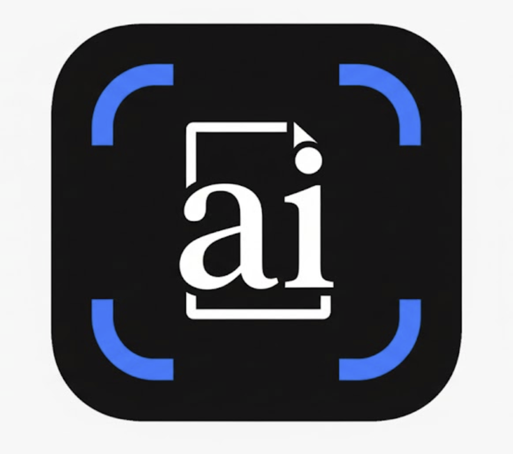

<p align="center">
  <a href="./public/logo.png" target="_blank">
    
  </a>
</p>

<h1 align="center">AI Doc Helper</h1>
<p align="center">🚀 AI 驱动的智能文档处理助手</p>

<p align="center">
  <a href="https://react.dev/"></a>
  <a href="https://www.typescriptlang.org/"></a>
  <a href="https://vitejs.dev/"></a>
  <a href="https://nodejs.org/">=18" /></a>
  <a href="https://www.npmjs.com/">=9" /></a>
  <a href="./LICENSE"></a>
</p>

<p align="center">
  <a href="#-简介">简介</a> ·
  <a href="#-核心功能">核心功能</a> ·
  <a href="#-快速开始">快速开始</a> ·
  <a href="#-技术栈">技术栈</a> ·
  <a href="#-截图展示">截图展示</a>
</p>

---

## 💡 简介

**AI Doc Helper** 是一款基于 **React + Vite +  API** 的专业文档处理工具，专为学术写作、报告生成和文档处理而设计。

它集成了 **Markdown 编辑器**、**Word 完美导出**（支持 LaTeX 公式）、**OCR 公式识别**以及 **AI 智能润色**功能，让你的文档创作效率提升！

## 📸 截图展示

### 1. 沉浸式编辑器 (Immersive Editor)
双栏设计，左侧 Markdown 编辑，右侧实时预览 Word A4 纸张排版效果。支持一键“学术化润色”和“LaTeX 公式修正”。

*(如果未显示图片，请截取编辑器界面并保存为 `docs/images/preview_editor.png`)*

### 2. AI 视觉识别中心 (OCR Intelligence)
支持截图识别数学公式、复杂表格和手写笔记。自动转换为 LaTeX 或 Markdown 格式，一键插入文档。

*(请截取 OCR 界面并保存为 `docs/images/preview_ocr.png`)*

### 3. 多文档智能处理 (Batch Processor)
批量文件重命名与周报自动聚合。AI 自动分析文件内容，提取关键信息（如作者、日期、作业批次）并生成规范文件名。

*(请截取多文档界面并保存为 `docs/images/preview_multidoc.png`)*

---

## ✨ 核心功能

### 📝 沉浸式编辑器
- **双栏实时预览**：左侧 Markdown 编辑，右侧 Word A4 纸张排版效果实时展示
- **丰富快捷键**：支持 Markdown 标准快捷键，大幅提升写作效率
- **同步滚动**：编辑与预览区域智能同步，聚焦当前位置

### 📄 Word 完美导出
- **智能转换**：自动将 Markdown 转换为 docx 格式
- **公式原生支持**：LaTeX 公式自动转为 Word 原生公式对象，可编辑
- **样式保留**：完美保留段落的格式、字体、颜色等样式信息

### 🤖 AI 智能润色
- **内置 Prompt 模板**：提供"导出预优化"、"学术化润色"等预设方案
- **自定义 Prompt**：支持自定义 AI 指令，满足个性化需求
- **多模型兼容**：支持 Google Gemini、通义千问、DeepSeek 等 OpenAI 格式接口

### 🔍 OCR 智能识别
- **截图识别**：直接粘贴截图即可识别内容
- **多格式支持**：支持识别数学公式、复杂表格和手写笔记
- **自动转换**：智能转换为 LaTeX 或 Markdown 格式，一键插入文档

### 📚 多文档处理
- **批量重命名**：AI 自动分析文件内容，提取关键信息生成规范文件名
- **智能聚合**：自动提取作者、日期、作业批次等元数据
- **周报神器**：一键聚合多份文档，自动生成统一周报

---

## 🚀 快速开始

### 环境准备

确保已安装 [Node.js](https://nodejs.org/)（推荐 v18 或 v20）

```bash
# 检查 Node.js 版本
node -v
npm -v
```

### 安装依赖

```bash
# 克隆项目（如果还没有）
git clone <项目地址>
cd ai-doc-helper

# 安装依赖包
npm install
```


### 启动开发服务器

```bash
npm run dev
```

启动成功后，浏览器访问 [http://localhost:5173](http://localhost:5173) 即可开始使用。

### API Key 配置

为了方便使用，您可以直接在网页右上角的 **「用户中心」** 填写 API Key：

- 支持的 AI 模型：
  - 🌐 **Google Gemini**
  - ☁️ **通义千问 (Alibaba Qwen)**
  - 🔮 **DeepSeek**
  - 🤖 **其他 OpenAI 格式接口**

> 🔒 **隐私保护**：API Key 仅保存在本地浏览器 LocalStorage 中，不会上传到任何服务器。

### 生产环境构建

```bash
# 构建生产版本
npm run build

# 预览构建结果
npm run preview
```

---

## 🛠️ 技术栈

| 技术 | 版本 | 说明 |
|------|------|------|
| **前端框架** | React 18 + TypeScript + Vite 5 | 现代化前端开发框架 |
| **语言** | TypeScript 5.x | 类型安全的 JavaScript 超集 |
| **构建工具** | Vite 5.x | 下一代前端构建工具 |
| **UI 样式** | Tailwind CSS | 实用优先的 CSS 框架 |
| **Markdown 渲染** | react-markdown | React 组件化的 Markdown 渲染 |
| **数学公式** | KaTeX + remark-math | 快速的数学公式渲染 |
| **Word 处理** | docx | 生成和操作 Word 文档 |
| **PDF 处理** | mammoth | 将 Word 转换为 Markdown/HTML |
| **AI 集成** | OpenAI API | 集成 OpenAI 模型 | 

---

## 📋 项目结构

```
ai-doc-helper/
├── components/          # 组件目录
│   ├── Editor/         # 编辑器组件
│   ├── Layout/         # 布局组件
│   ├── MultiDoc/       # 多文档处理
│   ├── OCR/            # OCR 识别
│   ├── PDF/            # PDF 转换
│   ├── Preview/        # 预览组件
│   ├── Research/       # AI 研究
│   ├── Tools/          # 工具组件
│   └── WebSum/         # 网页摘要
├── utils/              # 工具函数
│   ├── aiHelper.ts     # AI 辅助函数
│   ├── converter.ts    # 格式转换
│   ├── gemini.ts       # Gemini API 封装
│   └── settings.ts     # 配置管理
├── public/             # 静态资源
├── App.tsx             # 主应用组件
├── index.tsx           # 入口文件
└── package.json        # 项目配置
```

---

## 📄 许可证

本项目采用 [MIT License](./LICENSE) 开源协议。

---

## 🤝 贡献指南

欢迎提交 Issue 和 Pull Request！

---

## ⭐ Star History

如果这个项目对你有帮助，请给个 Star ⭐️ 支持一下！

---

<p align="center">
  Made  by SYSU - The College Dropout
</p>